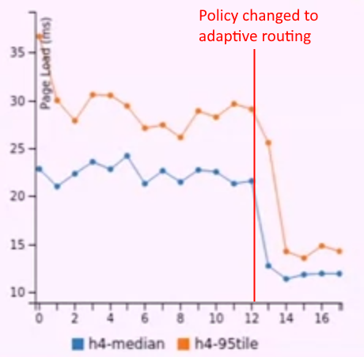

# Cloud Networking

The fifth course in the specialisation focused on the networking that is necessary to enable cloud computing. It explored how networks are built to allow infrastructure to be shared, to facilitate efficient transfer of big data, to provide low latency communication and to enable applications to be used across countries and continents.

## Week 1 Traffic Patterns and Physical Structure

Almost all popular web applications run on data centre networks. These networks must run support tasks to aid in the running of these applications. This type of infrastructure is key in large scale scientific computing also. Network traffic often follows a scatter-gather pattern, where servers make several requests in response to a query and then gather the responses from all these requests. Nevertheless, traffic patterns within a data centre depend on the specific applications being run on it. There is a trend of growing volume of intra data centre communication, with Google noting that their traffic tends to double every year. Facebook's survey on traffic locality suggested that most communication (~58%) happens within a cluster, 18% between data centres, 13% within racks and 12% within the data centre. These statistics suggests there is not a high degree of locality of communication within single racks. Part of the reason for this type of pattern is due to the distribution of storage that is necessary for maintaining high availability.

Facebook found that web servers had 100s to 1000s of concurrent flows, whilst Hadoop nodes around had around 25 connections on average. Other characteristics of network traffic include flow arrival times and flow sizes. These various traffic characteristics have implications for how the data centre should be designed. Some considerations for the design of the networks include high internal traffic, tight deadlines for network I/O, congestion and TCP incast, need for isolation across applications and the difficulties in using centralised control at the flow level due to the high flow rates.

The modern networked applications may need high bandwidth, low latency and fault tolerance. As there are lots of small requests in data centres, the probability that there are requests with slow responses goes up, so the applications using the network may need some way of tolerating some higher latency. Applications may experience different average latencies as the usage of the date centre network varies and the virtual machine running the application may be moved around to different parts of the network.

Planning a massive data centre requires many complex considerations such as controlling temperature and humidity. There must be careful consideration for the power infrastructure used to support the data centre. Data centres are organised into servers and racks. Racks have a top of the rack switch. Data centres are organised into multiple racks that must be connected together with a network. **Intra data centre** communication is typically much greater than external communication coming in from the internet. The ideal networking structure would be to connect all racks with each other with full bandwidth connections, but this design is expensive and the switches that connect the servers together would require many ports and high throughput. The reality is that this approach limits scalability due to the limitations of the switches. An alternative approach is to use a tree structured network, where there is a hierarchy of switches. However, certain patterns of traffic that heavily utilise the root of the tree may cause congestion at these high-level switches.

Clos networks allow all racks to communicate together, but use small, cheap elements to build large, high capacity networks. The Clos network design can be used to build a **Fat-tree** network. It addresses some of the weaknesses of the traditional tree network by making it more scalable and giving it higher throughput. Fat-tree networks have a degree of redundancy in the network by having multiple routes between pairs of racks.

One consideration for the design of data centre is the length of cables required. Longer cables must be optical rather than copper based, which require more expensive transceivers. Therefore, data centres converge on designs which require shorter cables. The topology of the network may affect how applications are deployed on the network, such that applications that need to communicate with each other have lower latencies if hosted closer together.

### Programming Assignment 1

The programming assignment required working on an emulated data centre running on a small topology consisting of two layers of switches (core switches and edge switches). The core switches connected to all edge switches and hosts were connected to the edge switches. The network was managed as a **Software Defined Network** (SDN) by having a controller connecting to all switches. The controller specified the forwarding behaviour for the switches based on a set of software defined rules. The purpose of the assignment was to run this network on a virtual machine and observe the impact of a poor routing policy on a video streaming application running on the network. There was one video streaming client and one video hosting server, with the rest of the hosts running bandwidth utilising _iperf_ applications. The naïve routing policy sent all traffic through a single core switch, rather than using all available routes. The result was that the client detected the low available bandwidth and requested low quality video blocks from the server, which was visible on the video player.

## Week 2 Host Virtualisation, Routing and Traffic Engineering, Congestion Control

Cloud computing relies on server virtualisation. Virtualisation allows the sharing of physical infrastructure, rapid deployment of virtual machines (VM) and live VM migration. The physical hardware that the VMs run on is managed through a hypervisor. The hypervisor manages the physical NIC (pNIC). The hypervisor runs a virtual switch, which connects to all the virtual NICs (vNICs) and the pNIC. Another way of achieving virtualisation is containers, which does not require guests OSs. Docker is an example of a container manager. Containers provide isolation between applications, but have a smaller footprint than a full guest OS on a VM. Containers can be brought up much faster than VMs.

Open vSwitch's goals are flexible and fast forwarding. The switch routing decisions are controlled from user space and packet forwarding is handled in the kernel. For the first packet of a flow, the rules in user space are consulted and subsequent packets of the flow use a collapsed rule in kernel space. Caches are used for the rules for forwarding packets, which reduces CPU utilisation at the host.

Routing is the task of finding paths between sources and destinations. Routing information needs to be installed on switches in order for them to facilitate this. Individual elements of the network may not have knowledge of the entirety of the network. The Spanning Tree Protocol (STP) uses a subset of networks links to route on, with these routes representing a tree. The advantage of this protocol is that it is simple and may work well if the network is already structured in a tree-like structure. The downside is that it ignores some of the bandwidth capacity available in the network through this simplification and it does not work well in networks that aren't like trees.

Transparent Interconnection of Lots of Links (TRILL) runs a link state protocol between switches, where every link learns the topology of the network. The the advantage TRILL has over STP is that all links can be utilised and multiple routes can be used. Open Shortest Path First (OSPF) over IP is another link state protocol, which also floods topology information, but uses more traditional routing and is better established. The downside of OSPF is that there is little control over routes that are used. Border Gateway Protocol (BGP) is the standard global scale routing protocol. It gives hosts a vector of paths that represent the options that a host can make to reach the destination. BGP can be used within data centres, with the autonomous systems (AS) representing groups of switches.

Multi-path routing allows for fault tolerance and traffic engineering. The Fat-tree topology is an example a network where there are multiple paths between sets of servers. Data centre operators often settle for inexact solutions for traffic engineering, as it is difficult to develop exact distributed algorithms for solving these types of problems. An example is Equal Cost Multi-Path Routing (ECMP). It works by choosing a path represented by a particular selection of routes. The selection is made by a hashing of the packet header, which helps avoid the reordering of packets in a flow that would otherwise cause TCP to drop packets. ECMP essentially randomly routes based on the concept of **Flowlets**, which are packets grouped by comparing the gap between outgoing packets and the conservative estimate of the latency in network. This is more fine-grained routing than flow-level routing. CONGO is similar to ECMP, but keeps a per-path table of congestion and chooses the least congested paths for flowlets.

Congestion control is the question of how the rates of flows are controlled in the network to maximise utilisation of the available capacity, whilst avoiding unfair capacity distribution and packet loss/delays. Traditional congestion control uses end-to-end information to make decisions about congestion. This method treats the network as a black box and just uses information about whether packets are received and how long the delay was. If all packets are ACK-ed, then flow rate can be increased, otherwise flow rate can be decreased. TCP uses this type of protocol to attempt to match the network's capacity. It uses slow-start, exponential increase, additive increase and then conservative back-off. If there is a large window of packet loss, TCP disconnects and goes back to slow-start.

The problems with TCP are that multiplicative decrease may be too aggressive, packet loss may be a poor signal of congestion and there is a lack of isolation across flows. Large queues in buffers can dominate the latency within a data centre. Buffers queues can cause delays to packets that do not have the same destination port. Applications using scatter-gather traffic patterns can be sensitive to latency, but can also be responsible for congestion and potentially lead to the TCP incast problem.

High throughput and low latency is desired in the network. Data Centre TCP (DCTP) is an adaptation of TCP to the data centre environment. It aims to manage congestion before buffers start to fill up and packets are dropped. DCTP uses **Explicit Congestion Notification** (ECN). When ECN enabled switches receive packets, the switch uses the average queue length over a recent time window and then decides whether to mark the ECN bit on the packet. The switch uses a high and low threshold to decide whether to mark the ECN bit. The receiver sends back this ECN data, so the original sender can react to the congestion level. Senders can half the send rate when congestion is detected, the same as TCP, but the system helps prevent the packet being lost. The sender can maintain a list of ECN data that it has received and use this to proportionally reduce its send rate, rather than always halve it. DCTP can be used to reduce buffer occupancy in the network, which can be useful in reducing latency in the network. One advantage of DCTP was that it works on existing hardware. The disadvantage is that DCTP and TCP do not work well together in the same data centre (although improved in DCTP+), DCTP still uses slow start which can be too conservative sometimes and there is no prioritisation of particular flows.

## Week 3 Software-Defined Networking Architecture, Multi-Tenant Data Centres

Software-Defined Networking (SDN) attempts to solve the problems that controlling networks is otherwise complicated, control is distributed and there is no clean programming API for doing it. Controlling the network can be particularly difficult in large, heterogenous networks. Innovation within traditional networks is difficult due to these characteristic. SDN uses a data plane API on the network devices in conjunction with a logically centralised controller. On top of the centralised controller are software abstractions such as a _network OS_ and on top of this there can be applications.

One of the core driving forces of SDNs, is making the network more flexible. Aspects of SDNs have been worked towards for some time. Label switching / MPLS allowed for setting explicit paths for classes of traffic. Active networks allowed packets to carry code within them that effected the operation of the network. A few projects that have historically driven towards logically centralised control include the Routing Control Platform, 4D architecture, Ethane, OpenFlow and NOX with many projects since. Hardware with standardised APIs makes it easier for operators to change hardware and for new vendors to enter the market. The centralised controller allows direct programmatic control of the network. Software abstractions make it easier to create high level policies, rather than having to work with complex distributed protocols. The challenges for SDN include scalability, distributed system challenges are still present underneath the idea of the logically centralised control, reaching agreement on the data plane protocol to use and devising the right high level abstractions. The first 'killer apps' for SDN were cloud virtualisation (for multi-tenancy) and inter-data-centre traffic engineering.

There are several key needs for building a multi-tenancy data centres. Agility is desired, which relies on location independent addressing, performance uniformity, security and network semantics. Agility is important for achieving high utilisation, because if there are otherwise lots of constraints in the data centre that may not otherwise be able to fully utilise the compute resources available. Agility is also important for availability, as an application may be need to be moved away from failing hardware or a highly congested portion of the network. Moving services is difficult in a traditional networking due to the lack of flexible addressing.

VL2 was one of the earliest virtualised data centre designed, which influenced the design of Microsoft Azure. It was motivated by a study of data centre traffic that showed that increasing internal network traffic was a bottleneck and they found that there were unpredictable, rapidly changing traffic patterns. This resulted in the design of a non-blocking fabric i.e. a network that didn't represent a bottleneck. Another motivating factor was the failure characteristics of the network, which was that it was difficult to ensure that reliability of a single device in the network. This lead to the design choice of redundancy in the core elements in the network - using a greater number of less powerful components rather than fewer, more powerful components. This is similar to a Clos network. A third motivating factor was that traffic was unpredictable, which resulted in the use of **Valiant Load balancing**, which does not rely on global coordination of traffic. The aim was to disperse traffic throughout the network.

In VL2, Application Addresses (AAs) are location independent and provide the illusion of a single big layer 2 switch connecting the applications. The physical network layer uses Locator Addresses (LAs) that are dependent on the location within the topology. The physical network layer uses layer 3 routing via OSPF. In between the application layer and physical network layer, there is a virtualisation layer, which contains the AA to LA mappings and a server agent responsible for wrapping AAs with an outer LA header. AAs provide some of the agility that is desired. L2 network semantics are being achieved by the agent intercepting and handling L2 broadcast and multicast. Performance uniformity is achieved through the Clos topology and the ECMP used provides load balancing. The directory system provides security by allowing or denying connections by choosing whether to resolve AAs to LAs.

Network Virtualisation Platform (NVP) was introduced in a paper on network virtualisation in multi-tenant data centres. The service has an arbitrary network topology, which works on top of any standard layer 3 network. The service network and the physical network are connected through a network hypervisor. The network is modelled as Logical Datapaths, each of which has their own OpenFlow table.

## Week 4 WAN, CDNs, Client Connectivity, Coping with Network Performance

Data centres communicate with each other over the internet, to replicate data for example. Multiple data centres are necessary for improving fault tolerance and availability, load balancing and lower latency due to closer proximity to clients. Different jurisdictions may require that data is stored within the jurisdiction, so more data centres may be necessary to have them within these jurisdictions. Google noted that it carries a higher volume of traffic between its data centres within its own private network (WAN), than outside of its private network. Private data centres can control their own routing, topology and congestion control protocols, unlike networking over public networks. WAN bandwidth is an expensive resource.

The traditional WAN approach uses Multiprotocol Label Switching (MPLS). The MPLS steps are first use a link state protocol, use bandwidth info flooding, fulfil tunnel provisioning requests, update network state and then flood info. The downside of this approach is inefficiency, because the network is provisioned for _peak_ traffic and the average traffic might be much lower, thus wasting expensive WAN bandwidth. MPLS does not intelligently distinguish between latency sensitive traffic and non-latency sensitive traffic, which would otherwise allow for a protocol that smooths the bandwidth usage. A second problem with MPLS is that it only provides link-level fairness rather than network-wide fairness.

To approve on the MPLS approach, a view of the entire network is required. Google and Microsoft have both tried to find solutions to address some of the problems with MPLS. The commons themes are differentiating between latency sensitivities in traffic, centralising traffic engineering using SDN (OpenFlow), avoiding exact solutions so faster decisions can be made, using a dynamic reallocation of bandwidth and using edge rate limiting.

Google's B4 was the first highly visible success of using SDN. It uses a Quagga software switch in conjunction with OpenFlow. Quagga communicates with the cluster border routers using eBGP and OpenFlow communicates with WAN routers to set up forwarding rules. This setup allows the WAN routers to be simple. A traffic engineering server allows for centralised control through communication with the OpenFlow controller. BGP forwarding tables are kept in the switches as a backup option. Google have built their own cheap, simple, custom switches for B4. The effect of the system is to achieve nearly 100% utilisation of the WAN bandwidth capacity. Microsoft's solution is SWAN, which has many similarities to B4, but also has some different features. SWAN aims to be able to make changes to traffic flow without causing congestion. Both B4 and SWAN have the advantage of knowing which parts of their traffic are latency sensitive, unlike when WAN traffic engineering is done by ISPs.

Content Distribution Networks (CDNs) are necessary to provide users with servers that are close to them so that they can achieve lower latency. Google has noted that an additional delay of 0.4 seconds was associated with 0.74% fewer searches by users. This represents a sizable loss in revenue and shows that users are sensitive to increases in latency. Applications such as video streaming require moving huge volumes of data across expensive WAN networks. Caching has been one approach to reduce WAN traffic used for content delivery, but with the present day volume and diversity of content, dynamic content and encrypted content, caching is not enough. There is a need for high capacity connections between CDN nodes or to the client from the origin server and this is done either using an ISP or private fibre that is either leased or owned.

Clients need a way of choosing which CDN node to get content from, based on metrics such as latency and the current load on the different nodes. Some bigger companies have their own CDNs, but often it is provided by a third party like Akamai, Limelight or Level3. Content server locations are usually chosen based on network distances. Internet Exchange Points (IXPs) are often chosen, which puts them close to ISP infrastructure. ISPs like to facilitate this as it reduces the traffic that the ISP has to carry over their network and it also reduces latency for their users. CDNs host content that has different latency sensitivities, for example web content is often latency sensitive, but video content is less latency sensitive due to buffering. Routing on the internet can sometimes be circuitous and paths are chosen based on costs as well as congestion and path length. Configuration errors can be another cause of sub-optimal pathing. Overlay routing can be used to lower latency and packet loss.

An origin server may have a high latency to the client and this is exasperated by TCP slow-start. The problem can be partly resolved by using **persistent connections**. The client performs a TCP handshake with a nearby CDN node, which uses the persistent TCP connection to get the content from the origin server without using slow-start and the nearby node can then transfer the content to the client (perhaps using slow-start). The RTTs to the nearby CDN node are much lower, which speeds up the overall content delivery process and this is a particularly advantage for SSLs connections that require more round-trips. CDNs are used through the rewriting of URLs by the webserver when particular URLs are requested by the client. The client requests the URL from the local DNS resolver, which communicates with the Top-Level-Domain (TLD) resolver to get the Canonical Name (CN), which gets sent to the CDN resolver to get a CDN address close to the local DNS resolver. Sometimes a local CDN resolver is used as another step. At the CDN cluster, the request is routed to a suitable CDN server.

End-user connectivity to compute and storage services place different requirements on the network. Applications like file sharing and video streaming require high bandwidth, but not necessarily low latency. Web browsing however, does often require low latency, but usually has a cap on bandwidth requirements. It is often repeated that >80% of internet traffic is video content, but this does not mean that networks should be tailored purely for this type of content. Having low latency on a subset of the remaining traffic may be just as valuable. Google came up with an experiment to quantify the value of low-latency. The results show that artificially increasing the latency for test users reduced the amount of searches performed compared to a non-altered control group. Latency can be a bottleneck for many applications and is typically a more difficult problem to solve than achieving higher bandwidth. Part of the problem with latency is that it is bounded by the speed of light (actually 2/3 of C in optical fibre), which becomes a bigger factor over longer distances. For applications like multiplayer gaming where users may need to connect with each other, CDNs do not help and instead the performance of the network itself must be low latency. Google's QUIC is one method that has been tried to reduce latency.

There are application-level tweaks that can be made to cope with variations in network performance. End-to-end checksums can be implemented at the application-level to ensure that the data received has not been altered, but whether this is necessary depends on the properties of the networking protocols and the underlying network being used. Certain network properties are fairly universal, so are built into the network protocols, such as reliable packet delivery through TCP. However, sometimes applications need to be adapted to ensure that their network communications are as desired. One adaptation is to build in tolerance for partial responses from the network, so that progress can be made despite message loss or delay. In Cassandra, redundant requests are sent out when the original request is slower than expected and Google's BigTable has the additional feature that queries can be cancelled if no longer needed, which reduces unnecessary work. These techniques have been shown to achieve a large decrease in response time for some requests; in particular it is good for dealing with requests that would otherwise be very slow. Speeding up the small proportion of requests that are very slow can substantially decrease total job time.

TCP incast occurs where a large number of senders send packets to a network port, which overwhelms the buffer and causes packet loss and delay. Packet loss and delays can cause TCP flows to timeout and TCP throughput to collapse. Chances of TCP incast can be reduce by limiting the size of individual responses, ignoring late responses from workers and deliberately spacing out requests and responses (typically the best option). Spacing out requests and responses increase the latency in the common case, but decreases the latency in situations in which TCP incast would otherwise occur. Facebook scales Memcache to help deal with TCP incast.

Rate adaptation is an application-level tweak that is used to deal with the variability in available bandwidth on a network. In video streaming, several seconds of latency is seen as acceptable, due to the presence of buffers. The user only notices degradation in video experience if the buffer empties. The common solution is to encode video in multiple bit-rates, estimate the connection's bandwidth and then then pick the video rate that is less the available bandwidth. Capacity estimation is important for rate adaptation, but can be tricky to do accurately. Buffer occupancy gives little information during the start up phase.

## Week 5 Programming Assignments

### Programming Assignment 2

The goal of the second assignment was to extend the code worked on in the previous assignment to implement a traffic monitor for the emulated network. The traffic monitor had to be able to measure received and transmitted traffic from each host. The network topology remained the same, except for the presence of an OpenFlow SDN controller, which was connected to each core and edge switch. One host ran a video server, one ran a video client and the rest ran iperf. The SDN controller sent messages to each edge switch to ask for port statistics. Each switch maintained statistics on transmitted and received packets for each port, as well as number of dropped packets. The switches replied to the SDN controller with all of its port statistics. The solution was implemented in Python and was tested whilst running the emulated network within the Virtual Machine. The traffic monitoring application provided traffic statistic summaries that could be viewed in-browser at a local address.

### Programming Assignment 3

The goal of the third assignment was to improve upon the naïve routing protocol that was used in the first assignment. In the first assignment, the poor performance of the routing protocol could be observed by the low bitrate video that was visible on the video client - this happened due to congestion in the network, which resulted in the **adaptive scaling** choosing a lower bitrate. The routing protocol to be implemented in this assignment was a static assignment of hosts to different core switches. Video streaming traffic would be sent through one core switch and iperf traffic would be sent to the other core switch. After implementing the protocol in Python for the SDN controller, the emulated network was run again to re-test the video streaming performance. The video played in high quality, which demonstrated the improvement over the naïve routing protocol.

### Programming Assignment 4

The goal of the fourth assignment was to further improve the routing policy to account for a larger number of tenants and core switches and a skew in the traffic demands of tenants. The traffic controller had to balance the load on each of the core switches by using the data collected from the traffic monitor. The application of interest was a _Memcached_ application instead of the video player. Memcached is a distributed cache that stored objects in memory. The performance was measured through page load times, which required the servicing of several Memcached requests. The page was considered loaded when all of the Memcached requests had been serviced, so the performance was determined by the _slowest_ response time. Hosts would either be running Memcached, iperf or be inactive and the host types would be mixed among the edge switches.

The static routing policy previously used made the mistake of assigning all traffic to one core switch, which made it no better than the naïve routing protocol. The adaptive protocol was implemented in Python. The statistics web page allowed for the selection of the routing policy being used. Changing the routing policy from either the naïve or static routing policy to the adaptive policy caused a significant drop in page load times as visible on the page load time graph.

Page load times:

